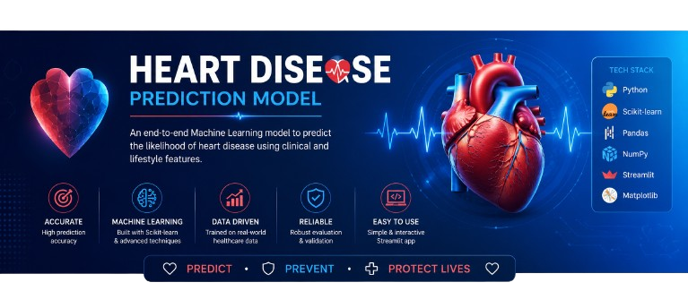

# ❤️ Heart Failure Survival Predictor AI

<p align="center">
  
</p>

<p align="center">


</p>

<p align="center">
A Machine Learning application that predicts the survival probability of heart failure patients using clinical health records and an interactive Streamlit dashboard.
</p>

---

# ✨ Features

- ❤️ Predicts heart failure survival in real time
- 🤖 Machine Learning model trained with Scikit-learn
- 📊 Clean and interactive Streamlit interface
- 📈 Displays prediction probability
- ⚡ Instant predictions from clinical inputs
- 🎯 User-friendly dashboard
- 📱 Responsive and lightweight design

---

# 🛠 Tech Stack

| Category | Technologies |
|----------|--------------|
| Programming | Python |
| Machine Learning | Scikit-learn |
| Data Analysis | Pandas, NumPy |
| Visualization | Matplotlib, Seaborn |
| Deployment | Streamlit |
| Model Storage | Joblib |

---

# 📷 Application Preview

## 🏠 Home Screen

<p align="center">

</p>

---

## 📊 Prediction Result

<p align="center">

</p>

---

# 🧠 Input Features

| Feature | Description |
|---------|-------------|
| Age | Patient's age |
| Sex | Male / Female |
| Anaemia | Presence of anaemia |
| Diabetes | Diabetes status |
| Smoking | Smoking history |
| High Blood Pressure | Hypertension status |
| Creatinine Phosphokinase | CPK enzyme level |
| Ejection Fraction | Heart pumping efficiency |
| Platelets | Platelet count |
| Serum Creatinine | Kidney function indicator |
| Serum Sodium | Sodium concentration |

---

# 📂 Project Structure

```text
Heart-Failure-Survival-Predictor-AI/
│
├── utils/
│   ├── Banner.png
│   ├── Home.png
│   └── Result.png
│
├── app.py
├── Heart_disease_model.pkl
├── requirements.txt
├── README.md
└── LICENSE
```

---

# ⚙️ Installation

```bash
git clone https://github.com/kaliprogramer/Heart-Failure-Survival-Predictor-AI.git

cd Heart-Failure-Survival-Predictor-AI

pip install -r requirements.txt

streamlit run app.py
```

---

# 🚀 How It Works

1. Enter the patient's clinical information.
2. Click **Predict**.
3. The trained Machine Learning model analyzes the data.
4. The application displays:
   - Survival Prediction
   - Confidence Score
   - Prediction Probability

---

# 🎯 Future Improvements

- Explainable AI (SHAP)
- Random Forest & XGBoost comparison
- Patient PDF report generation
- Cloud deployment
- REST API with FastAPI
- Docker support
- User authentication

---

# 📄 License

This project is licensed under the **MIT License**.

---

<p align="center">

⭐ If you found this project useful, consider giving it a star!

</p>
